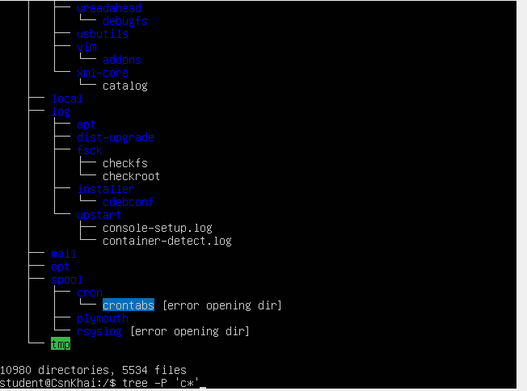
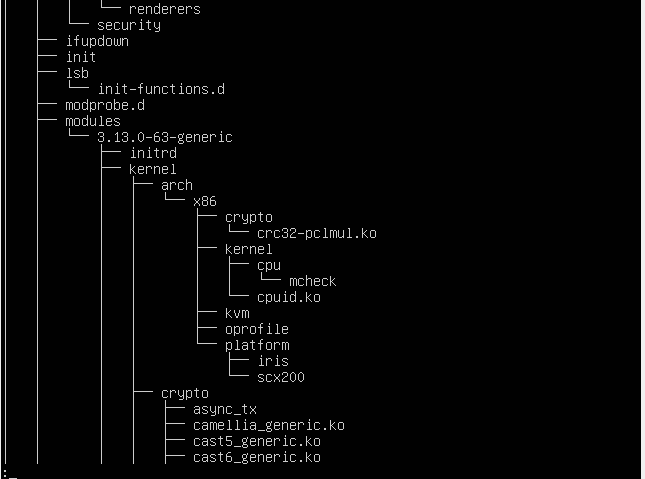

1) Изучить команду tree. Освоить технику применения шаблона, например,
вывести все файлы, которые содержат символ с, или файлы, которые
содержат определенную последовательность символов. Вывести
подкаталоги корневого каталога до второго уровня вложенности
включительно.
	За допомогою команди sudo apt-get install tree завантажуємо tree, щоб подалі ним користуватися. Далі, щоб вивести файлі, які містять символ ‘c’ вводимо команду tree -P ‘c*’
 

Рис.1 Отримали файли з символом ‘c’.
 

Рис.1.1 Також можна написати tree -P ‘c*’ | less, щоб пролистати усі файли.
	Щоб вивести каталоги до 2 рівня вкладеності включно застосовуємо команду tree -L 2
 
2) С помощью какой команды можно определить тип файла (например,
текстовый или бинарный)? Привести пример.
 
Рис.2.1 За допомогою команди file filename можна визначити тип файла
	Наприклад, у каталозі bin обираємо будь-який файл та перевіряємо його тип file echo. Отримуємо файли типу elf (бінарні)
 
Рис.2.2 Текстовий файл – ASCII text
3) Овладеть навыками навигации по файловой системе при помощи
относительных и абсолютных путей. Как можно вернуться в домашний
каталог из любого места в файловой системе?
Відносний путь: путь відносно поточної папки
Абсолютний путь: повинні вказати повний путь від кореня до потрібного файла
	Наприклад, створимо папку one в student.
Відносним шляхом до неї буде, знаходячись в student, cd  one.
Абсолютним буде, знаходячись в student, ввести cd /home/student/one
Обидва варіанта приведуть до папки one.
 
Рис.3 Абсолютним і відносним шляхом досягли папки one
4) Ознакомиться с различными ключами команды ls. Привести примеры
распечатки каталогов с использованием различных ключей. Объяснить
выведенную на терминал информацию с помощью ключей –l и -a.
ls -a - відображає всі файли, включаючи приховані(перед ім'ям яких стоїть крапка)
ls -l виводить докладний список, в якому буде відображатися власник, група, дата створення, розмір та ін.
 
Рис.4.1 Використання команд ls -a  та ls -l
 
Рис.4.2 Команда ls -r сортує у зворотному порядоку
 
Рис.4.3 Команда ls -U – виводить несортований список каталогів ls -1 -виводить у стовпчик (один файл на один рядок)
5) Выполнить следующую последовательность операций:
- создать в домашнем каталоге подкаталог;
 
Рис.5.1 За допомогою команди mkdir створюємо подкаталог newfolder

- в этом подкаталоге создать файл, содержащий информацию о
каталогах, находящихся в корневом каталоге (используя операции
перенаправления ввода-вывода);
 
Рис.5.2.1 Заходимо у папку newfolder та пишемо команду nano. З‘являється редактор. Натискаємо ctrl+O, щоб зберігти, та вводимо назву файла. Щоб вийти натискаємо ctrl + X
 
Рис.5.2.2 Створили файл file.
- просмотреть созданный файл; 
Щоб подивитися зміст файлу скористаємося командою cat file
 
Рис.5.2.3 Записали у файл дані корневих каталогів (ls -l  /) у файл > file
ls -l / > file
- скопировать созданный файл в домашний каталог используя относительную и абсолютную адресацию.
 
Рис.5.3.1 Абсолютна адресація: cat file > /home/student/file.txt . Так як file.txt не існує, то він автоматично створиться.
 
Рис.5.3.2 Відносна адресація. Створимо файл file2 у домашньому каталозі. Знаходячись у папці new вводимо cp file ~/file2
- удалить созданный ранее подкаталог с файлом с запросом на удаление;
 
Рис.5.4 За допомогою команди rm -R newfolder ¬ми можемо видалити папку з файлами. Для того, щоб був запрос на видалення додамо ключ -i. Маємо:
rm -R -I newfolder
- удалить файл, скопированный в домашний каталог.
 
Рис.5.5 Скориставшись комадою rm file1 file2 видаляємо файли file1 та file2
6) Выполнить следующую последовательность операций:
- создать в домашнем каталоге подкаталог test;
 
Рис.6.1 Створюємо каталог test
- скопировать в этот каталог файл .bash_history при этом сменив его
имя на labwork2;
 
Рис.6.2.1 Командою cp .bash_history /home/student/test/ копіюємо файл до test
 
Рис.6.2.2 mv -v .bash_history labwork2 – змінюємо ім’я на labwork2
- создать жесткую и мягкую ссылку на файл labwork2 в подкаталоге
test;
 
Рис.6.3 ln labwork2 hardlink – створюємо жорстке посилання
ln -s labwork2 softlink – створюємо мягке посилання
- как определить мягкую и жесткую ссылку, что означают эти
понятия;
 
Рис.6.4 За допомогою команди file визначаємо посилання
Символічні посилання – зберігають адрес на файл
Жорсткі посилання –  (копія)файл, який посилається на ту ж саму область данних, що й сам файл.

- измените данные, открыв символическую ссылку. Какие изменения
произойдут и почему
Так як softlink символічне посилання, то змінивши в ній вміст, зміниться текст і в labwork2. Жорстке посилання - копія labwork2, тому скопіює оновлений текст собі.

 
Рис.6.5.1 Дивимось, що міститься в softlink
 
Рис.6.5.2 Змінюємо символічне посилання nano softlink
 
Рис.6.5.3 Дивимось зміни
- переименуйте файл жесткой ссылки в файл hard_lnk_labwork2;
- переименуйте файл мягкой ссылки в файл symb_lnk_labwork2;
 
Рис.6.6 Змінюємо назви
- затем удалите файл labwork2. Какие произошли изменение и почему?
	Файл жорсткого посилання залишився, так як це копія файлу labwork2, яка копіює його вміст собі, але більш не залежить від нього. А символічне посилання - покажчик на даний файл, тому після його видалення є недоступною.

 
Рис.6.7 Після видалення labwork2 жорстке посилання залишилося, а символічне стало недоступним.
7) Используя утилиту locate найти все файлы, в которых встречается
последовательность squid и traceroute.
 
Рис.7.1 Встановлюємо locate
 
Рис.7.2 Вивели файли, які містять “squid traceroute”

8) Определить, какие разделы смонтированы в системе, а также типы этих
разделов.	
 
Рис.8 df виводить змонтовані розділи, а df -T окрім цього виводить їх типи.
9) Підрахувати кількість рядків, що містять задану послідовність
символів в заданому файлі.
Створимо в student файл file
 
Рис.9 . Знайдемо кількість рядків, які містять слово hello.
grep hello file | wc -l

10) Використовуючи команду find знайти всі файли в каталозі /etc, які містять послідовність символів host.
 
Рис.10 Заходимо в каталог etc (cd etc). Далі вводимо команду sudo find -name "host *" і бачимо всі файли, які містять слово "host".
11) Вивести всі об'єкти каталогу / etc, що містять послідовність символів ss. Як можна продублювати аналогічну команду використовуючи зв'язку з командою grep.
 
Рис.11.1 Командою find виводимо все об’єкти etc, що містять “ss”
 
Рис.11.2 Робимо те ж саме за допомогою команди grep. Отримуємо файли
12) Организовать поэкранную распечатку содержимого каталога /etc.
Подсказка: необходимо использовать операции перенаправления потоков.
ls | less
 
Рис.12 ls | less
13) Какие бывают типы устройств и как определить тип устройства?
Привести примеры.
 
Рис.13 sudo lshw -short – краткая информация про устройства
14) Как определить тип файла в системе, какие типы файлов бывают?
Текстовые, бинарные.
 
Рис.14 file filename – тип файла filename
15) * Вывести первые 5 файлов каталога, к которым был недавно
осуществлен доступ в каталоге /etc
 
Рис.15 find -ctime +1 |head -n 5

