1) Проаналізувати структуру файлу / etc / passwd і / etc / group, які поля в ній присутні, які користувачі в системі існують? Вкажіть кілька псевдопользователей, як їх визначити?

Root, системні користувачі, звичайні, псевдо.
Псевдопользователі мають uid 1 - 99: bin, lp, nobody 

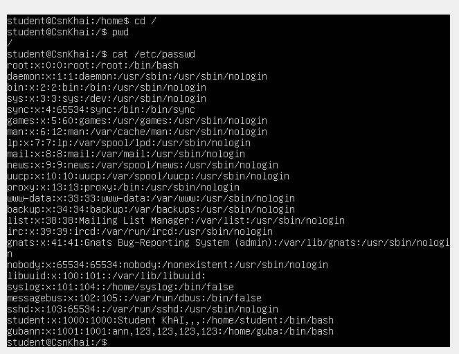

Рис.1.1 cat /etc/passwd  присутні поля користувачів.

 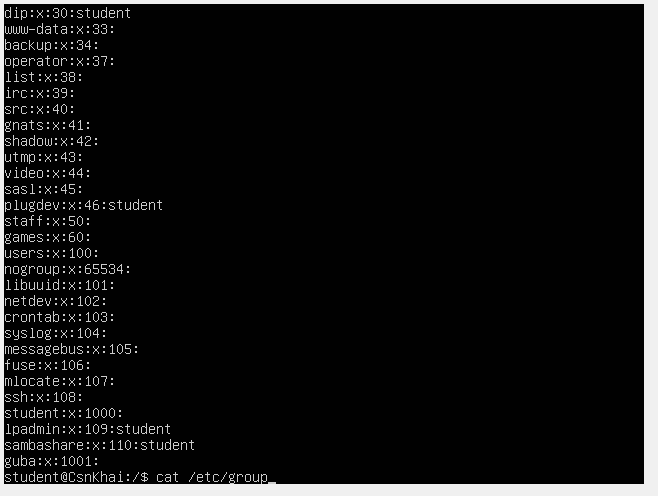
 
Рис.1.2 cat /etc/group  присутні поля груп.

2) Які існують негласні діапазони uid? Що таке UID? Як його визначити?
 
Uid - це позитивне ціле число за яким система відстежує користувачів. 3е поле в / etc / passwd - uid користувача

500 - 999 зазвичай сис.користувачі
>= 1000 нові додані користувачі

3) Що таке GID? Як його визначити?

GID - це ідентифікаційний номер групи. 4е поле у файлі passwd, наступний після uid.

4) Як визначити, хто входить в яку групу? 

 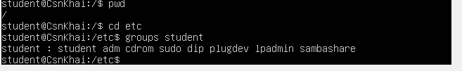
 
Рис.2.1 groups username – визначає, в яку групу входить користувач (username)

  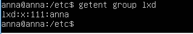
  
Рис.2.2 getent group groupname – визначити за назвою групи користувачів, що входять до неї

5) Які існують команди для додавання користувача в систему?
Які основні параметри, необхідні для створення користувача?
Adduser, useradd

Рис.3.1 – 3.3 Створення користувача за допомогою команди adduser username

  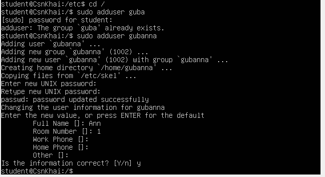
  
Рис.3.1

  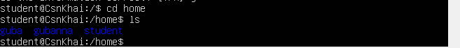
  
Рис.3.2

  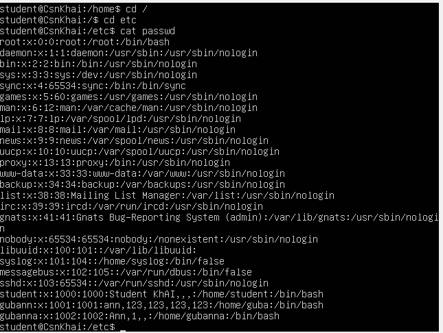
  
Рис.3.3

  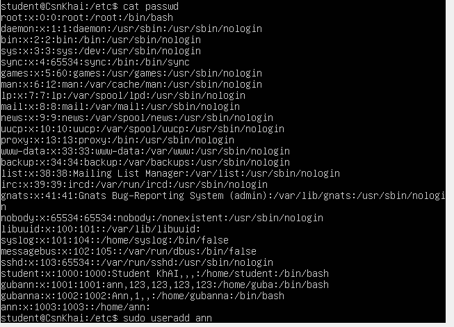
  
Рис.3.4 Додаємо користувача – useradd username

6) Як змінити ім'я (ім'я облікового запису) існуючого користувача?

  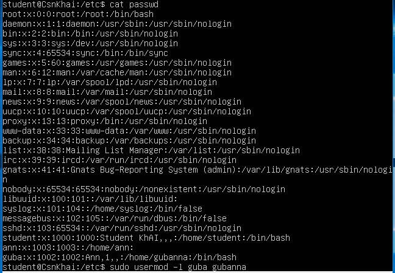
  
Рис.4 За допомогою команди usermod змінюємо gubanna на guba

7) Що таке skell_dir? Яка його структура?

  /Etc/skel каталог з дефолтними файлами,  які копіюються в домашній каталог кожного користувача при його створенні. 
  
   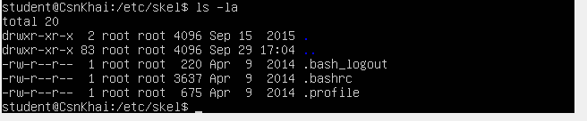
   
Рис.5 Структура католога skel

8) Як видалити користувача з системи (включаючи його поштову скриньку)?

  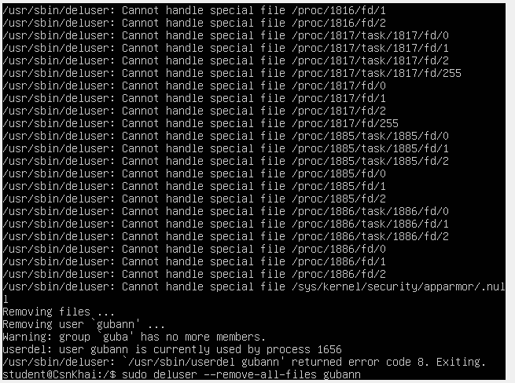
  
Рис.6.1 Видаляємо користувача (sudo deluser –remove-all-files username)

  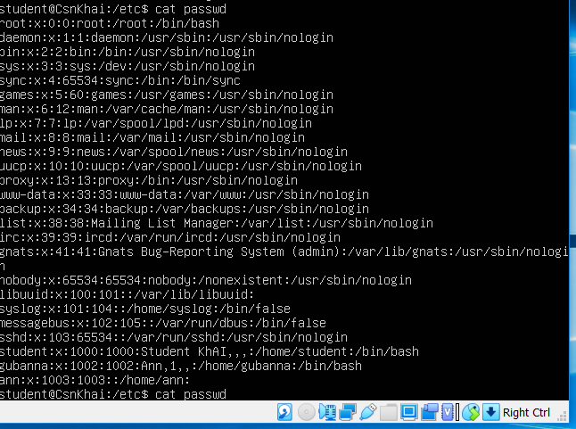
  
Рис.6.2 Перевіряємо у файлі passwd

9) Які потрібно використовувати команди і ключі для блокування і розблокування облікового запису користувача? 

 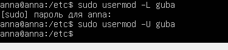
 
Рис.7.1 Блокуємо користувача sudo usermod -L username

Розблоковуємо – sudo usermod -U username

  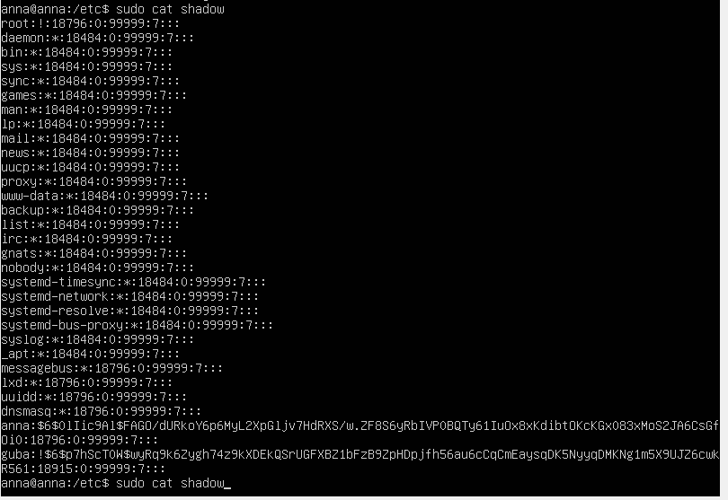
  
Рис.7.2 якщо стоїть знак оклику в полі пароля, то користувач заблокований

10) Як зняти пароль користувача і надати йому безпарольний вхід для подальшої зміни їм пароля?

  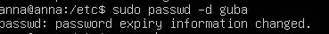
  
Рис.8  Обнуляємо пароль sudo passwd -d username

11) Вивести розширений формат інформації про каталог, розповісти про інформаційні стовпці виведені на термінал. 

 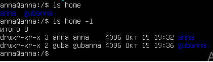
 
Рис.9.1 Розширена інформація про каталог – ls -l

Показуються права доступа, власник, група власника,  розмір, дата останньої зміни

  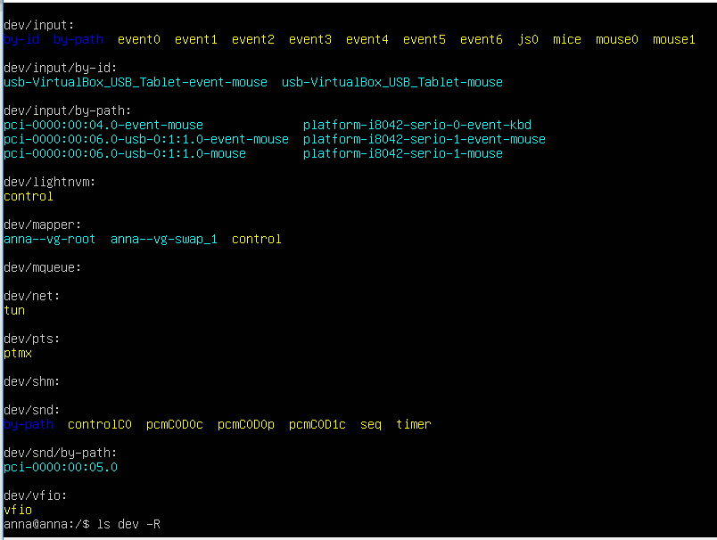
  
Рис.9.2 ls -R виводить також зміст внутрішніх катологів

12) Які права доступу існують і для кого (тобто описати основні ролі)? Опишіть коротко абревіатуру прав доступу.

Читання, запис, виконання. Власник, група, інші.

rwx-rwx-rwx - і користувач, і група та інші можуть читати, змінювати і виконувати файли.

13) Яка послідовність визначення відносин між файлом і користувачем?

Спочатку визначається для користувача, потім для групи та для інших (user, group, other) 

14) Які команди використовуються для зміни власника файлу (каталогу), а також режиму доступу до файлу? Наведіть приклади, продемонструйте на терміналі. 

 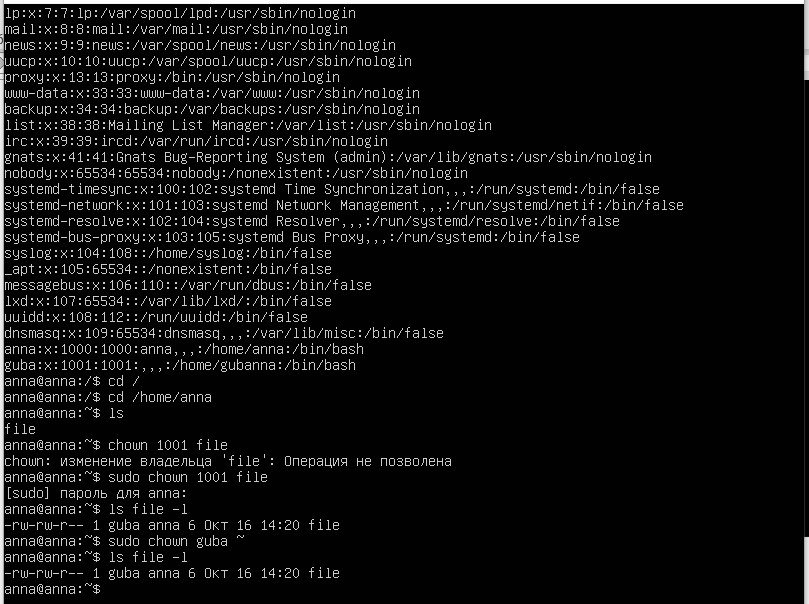
 
Рис.10.1 Встановили для file власника з uid 1001 – sudo chown 1001 file

  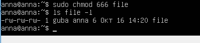
  
Рис.10.2 sudo chmod 666 filename – змінили права доступа до файлу

  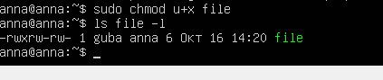
  
Рис.10.3 Додали user право на виконання файлу

15) Наведіть приклад вісімкового уявлення прав доступу? Опишіть команду umask.

Вісімкове представлення прав та їх символьне значення:

0644  -rw-r--r— 
0755  drwxr-xr-x 

Umask - це призначена для користувача маска (user mask), яка використовується для визначення кінцевих прав доступу.

  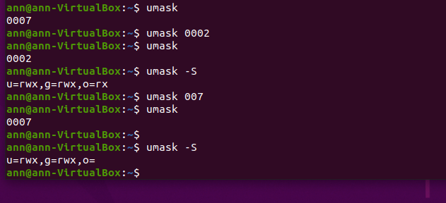
  
Рис.11 поточне значення маски umask та значення в символьній формі (umask -S). Зміна прав доступу umask 007

16) Дайте визначення sticky біт і механізму підміна ідентифікатора. Наведіть приклад файлів і каталогів з даними атрибутами.

	sticky bit – бит прикріплення. У файлі змушує систему при роботі програми оставлять образ її коду в пам'яті. У каталозі забороняє користувачам видаляти файли інших користувачів.
	
	Механізм підміни ідентифікатора - механізм, який дозволяє використовувати процеси з ідентифікаторами іншого користувача
	
  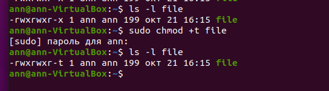
  
Рис.12 Використання sticky bit (додали до файла за допомогою команди sudo chmod +t filename)

17)* Які атрибути файлу повинні бути присутніми в командному скрипті?

Права доступу, місце знаходження файлу, власник.

